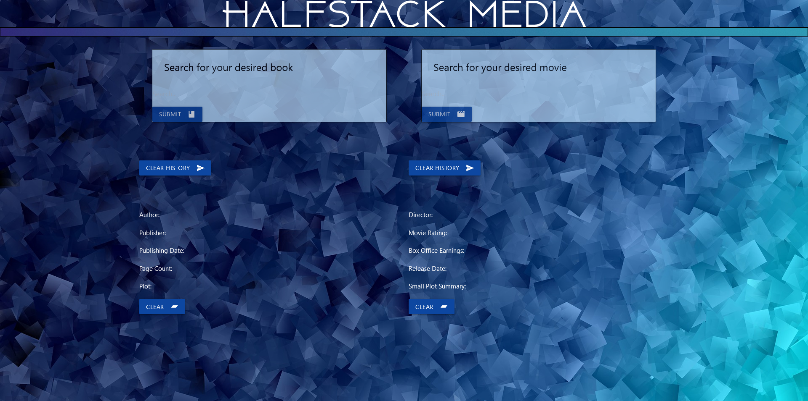

# Project-one (HALFSTACK MEDIA)

## Description
Group project - HALFSTACK MEDIA: A webpage made for users to search for information on any book and movie of their choosing. Displayed content and search history (up to 2 saved searches) can be cleared individually.

## Web Link
[What movie or book would you like to learn about? Click here!](https://lverghese.github.io/project-one/)

## Screenshot

Empty fields

Book search

Movie search

Third search/mixed

Cleared history for The Notebook

### Mobile view

## Built with
HTML
CSS
Materialize
Javascript

## Contribution
Completed by Logan Verghese (https://github.com/lverghese) & Kimberly Collazo (https://github.com/Lightfooted)